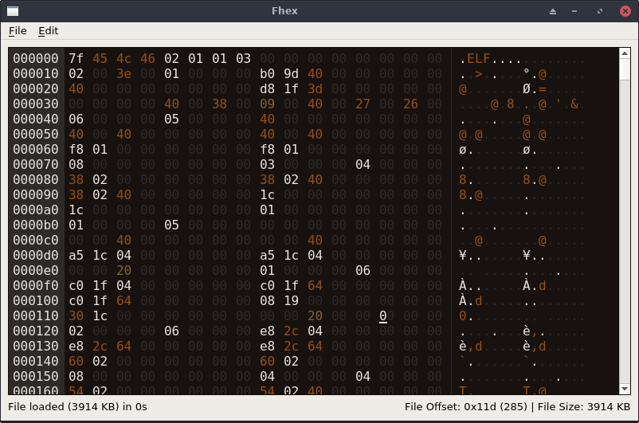
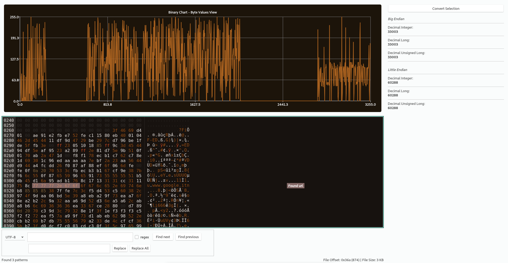
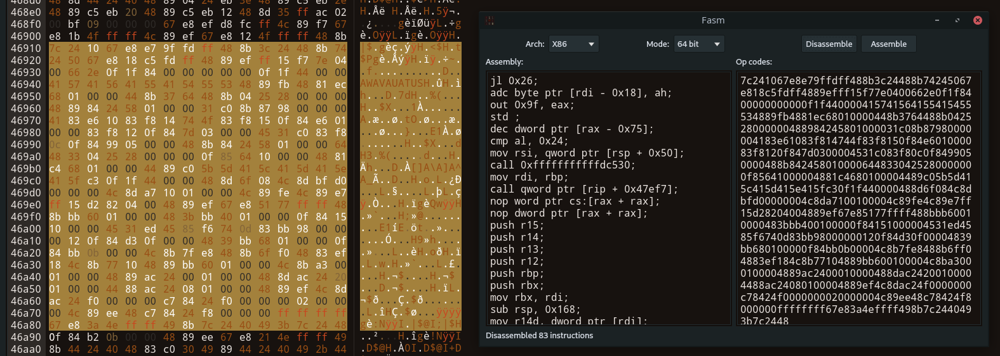

# Fhex - A Full-Featured HexEditor

This project is born with the aim to develop a lightweight, but useful tool. The reason is that the existing hex editors have some different limitations (e.g. too many dependencies, missing hex coloring features, etc.).

 



This project is based on **qhexedit2**, **capstone** and **keystone** engines. New features could be added in the future, PRs are welcomed.

## Features

* Chunks loader - Used to load only a portion of large files without exhaust the memory (use alt + left/right arrows to move among chunks). Please note that in chunk mode, all the operations (e.g. search) applies only to the current chunk except for file save (the entire file is saved). However, each time you edit a chunk, save it before to move to another chunk, otherwise you will lose your changes.
* Search and replace (UTF-8, HEX, regex, reverse search supported) [`CTRL + F`]
* Colored output (white spaces, ASCII characters, 0xFF, UTF-8 and NULL bytes have different colors)
* Interpret selected bytes as integer, long, unsigned long [`CTRL + B`]
* Copy & Paste  [`CTRL + C` and  `CTRL + V`]
* Copy selected unicode characters [`CTRL + Space`]
* Zeroing all the selected bytes [`Delete` or `CTRL + D`]
* Undo & Redo [`CTRL + Z` and `CTRL + Y`]
* Drag & Drop (*Hint:* Drag&Drop two files to diff them)
* Overwrite the same file or create a new one  [`CTRL + S`]
* Goto offset  [`CTRL + G`]
* Insert mode supported in order to insert new bytes instead to overwrite the existing one [`INS`]
* Create new instances [`CTRL + N`]
* Basic text viewer for the selected text [`CTRL + T`]
* Reload the current file [`F5`]
* Compare two different files at byte level
* Browsable Binary Chart (see later for details) [`F1`]
* Hex - Dec number converter [`F2`]
* Hex String escaper (e.g from 010203 to \x01\x02\x03) [`F3`]
* Pattern Matching Engine (see later for details)
* Disassebler based on Capstone Engine [`F4`]
* Assembler based on Keystone Engine [`F4`]
* Zoom-Out/Zoom-In bytes view (`CTRL + -/+`)
* Shortcuts for all these features

## Pattern Matching Engine
Fhex can load at startup a configuration file (from `~/fhex/config.json`) in JSON format with a list of strings or bytes to highlight and a comment/label to add close to the matches.

Examples:
```json
{
    "PatternMatching":
    [
        {
            "string" : "://www.",
            "color" : "rgba(250,200,200,50)",
            "message" : "Found url"
        },
        {
            "bytes" : "414243",
            "color" : "rgba(250,200,200,50)",
            "message" : "Found ABC"
        }
    ]
}
```
To activate pattern matching press `CTRL + P`
At the end, Fhex will show also an offset list with all the result references.
**Note:** Labels with comments are added only if the window is maximized, if labels are not displayed correctly please try to run pattern matching again.

## Binary Chart

Fhex has the feature to chart the loaded binary file (*Note:* In order to compile the project, now you need also `qt5-charts` installed on the system).
The y-axis range is between 0 and 255 (in hex 0x0 and 0xff, i.e. the byte values). The x-axis range is between 0 and the filesize.

The chart plots the byte values of the binary file and let you focus only on the relevant sections. For example, if in a binary file there is an area full of null bytes, you can easily detect it from the chart.

### License
GPL-3
